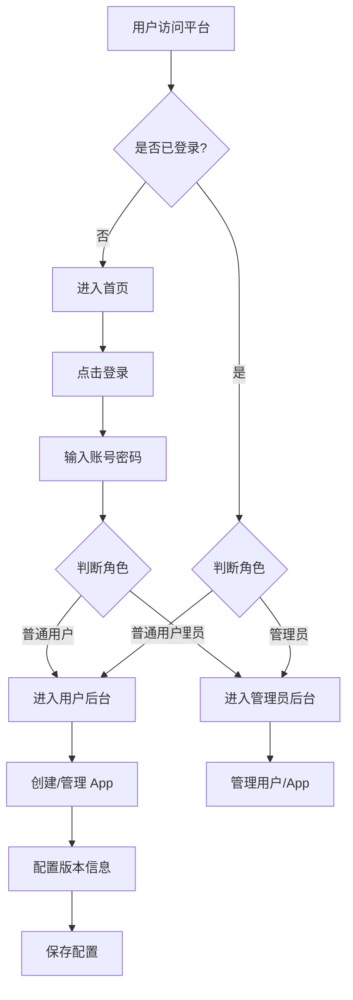

# HotUpdate API 快速平台 - 产品需求文档

## 1. 产品概述

面向 App 开发者的热更新 API 快速平台。提供 App 热更新配置管理、版本发布、下载地址维护等核心功能，帮助开发者快速搭建热更新服务。

- 主要用途：为 App 开发者提供统一的热更新 API 管理平台
- 目标用户：移动端 App 开发者、运维人员
- 产品价值：简化热更新配置流程，提供标准化 API 接口

## 2. 核心功能

### 2.1 用户角色

| 角色 | 登录方式 | 核心权限 |
|------|----------|----------|
| 普通用户 | 账号密码登录 | 创建/管理自己的 App，配置版本信息 |
| 管理员 | 账号密码登录 | 管理所有用户、所有 App，系统配置 |

### 2.2 功能模块

1. **首页（展示页面）**：平台介绍、功能特性展示、快速开始引导
2. **登录页面**：用户/管理员统一登录入口
3. **用户后台**：App 列表、创建 App、配置版本/下载地址/更新日志
4. **管理员后台**：用户管理、全部 App 管理、系统概览

### 2.3 页面详情

| 页面名称 | 模块名称 | 功能描述 |
|----------|----------|----------|
| 首页 | Hero 区域 | 平台标语、核心功能介绍、快速开始按钮 |
| 首页 | 功能展示区 | 展示平台核心功能（热更新API、版本管理、多App支持） |
| 首页 | 底部信息 | 版权信息、联系方式 |
| 登录页 | 登录表单 | 账号密码输入、角色自动识别、登录按钮 |
| 用户后台 | App 列表 | 展示用户创建的所有 App，支持搜索/筛选 |
| 用户后台 | 创建 App | 输入 App 名称、描述，自动生成 UID |
| 用户后台 | App 配置 | 配置版本号、最新下载地址（URL）、更新日志 |
| 管理员后台 | 系统概览 | 用户总数、App 总数、最近活动 |
| 管理员后台 | 用户管理 | 查看所有用户、启用/禁用用户 |
| 管理员后台 | App 管理 | 查看所有 App、编辑/删除 App |

## 3. 核心流程

用户登录流程：用户访问平台 → 点击登录 → 输入账号密码 → 系统判断角色 → 管理员进入管理后台 / 普通用户进入用户后台

App 创建流程：用户进入后台 → 点击创建 App → 填写 App 信息 → 系统生成唯一 UID → App 创建成功

版本配置流程：选择 App → 进入配置页面 → 填写版本号/下载地址/更新日志 → 保存配置

## 4. 用户界面设计

### 4.1 设计风格

- **设计风格**：玻璃液态（Glassmorphism）效果，高透明度圆角卡片
- **主色调**：白色背景（#FFFFFF），黑色文字（#1A1A1A）
- **辅助色**：浅灰边框（rgba(0,0,0,0.08)），玻璃效果使用 backdrop-blur
- **按钮样式**：圆角按钮（border-radius: 12px），黑色主按钮，白色次要按钮
- **字体**：思源黑体 / PingFang SC / system-ui，标题 28-36px，正文 14-16px
- **布局风格**：卡片式布局，大量留白，玻璃拟态卡片
- **图标风格**：使用阿里巴巴图标库（iconfont）线性图标
- **圆角**：统一大圆角（16-24px）

### 4.2 页面设计概述

| 页面名称 | 模块名称 | UI 元素 |
|----------|----------|---------|
| 首页 | Hero 区域 | 大标题、副标题、CTA 按钮、玻璃卡片装饰背景 |
| 首页 | 功能展示区 | 三列玻璃卡片，图标+标题+描述，hover 放大效果 |
| 首页 | 底部 | 简洁底部信息栏 |
| 登录页 | 登录卡片 | 居中玻璃卡片，输入框、登录按钮 |
| 用户后台 | App 列表 | 网格卡片布局，每个 App 一张玻璃卡片 |
| 用户后台 | 创建 App 弹窗 | 模态玻璃卡片，表单输入 |
| 用户后台 | App 配置面板 | 侧滑面板或新页面，表单配置 |
| 管理员后台 | 数据概览 | 统计卡片，数字+图标 |
| 管理员后台 | 表格 | 玻璃效果表格，斑马纹 |

### 4.3 响应式

- 桌面优先设计，最小支持 375px
- PC 端：导航栏悬浮在页面顶部
- 手机/平板端：导航栏固定在页面底部（类似移动端 Tab Bar）
- 断点：768px（平板）、1024px（桌面）

### 4.4 导航栏设计

- **PC 端**：页面顶部悬浮导航栏，玻璃液态效果，包含 Logo、导航链接、登录/用户头像
- **移动端**：页面底部固定导航栏，玻璃液态效果，图标+文字标签
