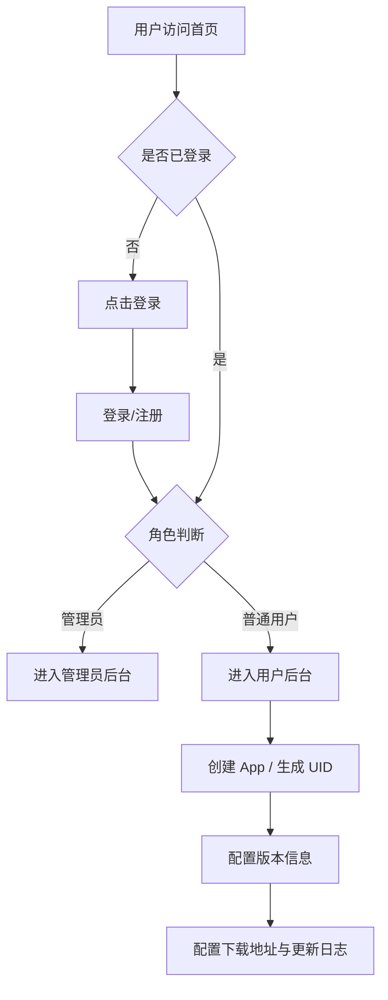

## 1. 产品概述

为 App 开发者提供热更新 API 的快速配置平台。用户可注册登录，根据角色（管理员/普通用户）进入不同后台：管理员进行全局管理，普通用户创建和管理自己的 App、配置版本与更新信息。

- **目标用户**：App 开发者，需要快速配置热更新分发
- **核心价值**：一键生成 App UID、管理版本、配置下载地址与更新日志

## 2. 核心功能

### 2.1 用户角色

| 角色 | 注册方式 | 核心权限 |
|------|---------|---------|
| 普通用户 | 注册/登录 | 创建 App、配置版本、下载地址、更新日志 |
| 管理员 | 系统指定 | 查看所有 App、用户管理、全局配置 |

### 2.2 功能模块

1. **首页**：瑞士现代主义排版风格，黑底白字，简洁介绍平台能力，无图标无 emoji
2. **登录/注册页**：账号认证，登录后根据角色跳转对应后台
3. **普通用户后台**：App 列表、创建新 App、版本配置（版本号、下载地址、更新日志）
4. **管理员后台**：全局 App 管理、用户管理

### 2.3 页面详情

| 页面名称 | 模块名称 | 功能描述 |
|---------|---------|---------|
| 首页 | Hero 区 | 大标题 + 副标题，瑞士现代主义不对称排版，黑底白字 |
| 首页 | 特性介绍 | 纯文字排版展示平台能力，不对称网格布局 |
| 首页 | CTA 区 | 引导用户注册/登录 |
| 登录页 | 登录表单 | 邮箱+密码登录，切换注册 |
| 用户后台 | App 列表 | 展示用户创建的所有 App，卡片式布局 |
| 用户后台 | 创建 App | 表单输入 App 名称，自动生成随机 UID（格式：yy+4随机字母+mm+4随机字母+dd+4随机字母+hh+4随机字母+分钟+4随机字母） |
| 用户后台 | 版本管理 | 为 App 配置版本号、最新下载 URL、更新日志 |
| 管理员后台 | 全局概览 | 统计面板、App 列表管理 |

## 3. 核心流程

## 4. 用户界面设计

### 4.1 设计风格

- **首页风格**：瑞士现代主义（Swiss Modernism），黑底白字，不对称网格排版，大字号标题，极简无图标无 emoji
- **后台风格**：玻璃液态效果（Glassmorphism），高透明度圆角卡片，毛玻璃模糊背景
- **主色调**：首页黑底(#000000)白字(#FFFFFF)；后台浅色背景搭配半透明白色卡片
- **字体**：首页使用无衬线几何字体（如 Helvetica Neue / Inter 变体），大标题 + 宽松字距
- **圆角**：后台卡片大圆角(16-24px)，按钮圆角(12px)
- **菜单栏**：悬浮式，PC 端位于页面顶部悬浮，移动端/平板位于页面底部悬浮，圆角 + 阴影

### 4.2 页面设计概览

| 页面名称 | 模块名称 | UI 元素 |
|---------|---------|--------|
| 首页 | Hero | 大标题左对齐，副标题小号字右对齐，不对称布局，黑白对比 |
| 首页 | 特性区 | 纯文字网格，不同字号层级，无图标 |
| 后台通用 | 菜单栏 | 悬浮圆角，PC顶部/移动端底部，包含"首页""我"+语言切换 |
| 用户后台 | App 卡片 | 玻璃液态卡片，半透明背景，圆角大，模糊阴影 |
| 用户后台 | 创建 App 表单 | 模态框/侧边栏，玻璃液态效果 |
| 登录页 | 登录卡片 | 居中玻璃液态卡片 |

### 4.3 响应式设计

- **PC（>1024px）**：菜单栏悬浮于页面顶部，水平排列
- **平板（768-1024px）**：菜单栏悬浮于页面底部
- **手机（<768px）**：菜单栏悬浮于页面底部，紧凑布局
- 首页文字排版自适应缩放

## 5. 国际化

- 默认语言：English (en)
- 支持语言：English (en)、繁体中文 (zh-TW)
- 语言切换位于悬浮菜单栏内