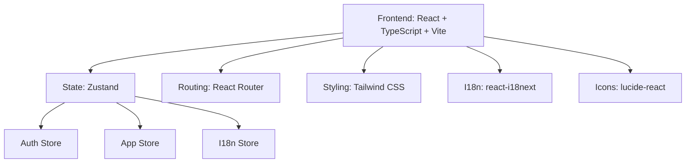

## 1. 架构设计



## 2. 技术说明

- **Frontend**：React@18 + TypeScript + Vite + Tailwind CSS@3
- **初始化工具**：vite-init (react-ts 模板)
- **状态管理**：Zustand
- **路由**：React Router DOM v6
- **国际化**：react-i18next + i18next
- **图标**：lucide-react（后台用）
- **后端**：暂无（前端先行，数据使用 localStorage + mock）

## 3. 路由定义

| 路由 | 页面 | 说明 |
|------|------|------|
| `/` | HomePage | 首页（瑞士现代主义风格） |
| `/login` | LoginPage | 登录/注册页面 |
| `/dashboard` | DashboardPage | 普通用户后台 |
| `/admin` | AdminPage | 管理员后台 |

## 4. 数据模型

### 4.1 用户 (User)

```typescript
interface User {
  id: string;
  email: string;
  password: string; // mock only
  role: 'admin' | 'user';
  createdAt: string;
}
```

### 4.2 App

```typescript
interface App {
  id: string;
  uid: string; // yy+4字母+mm+4字母+dd+4字母+hh+4字母+分钟+4字母
  name: string;
  userId: string;
  createdAt: string;
}
```

### 4.3 版本 (Version)

```typescript
interface Version {
  id: string;
  appId: string;
  version: string;
  downloadUrl: string;
  changelog: string;
  createdAt: string;
}
```

### 4.4 UID 生成规则

```
yy + 4随机字母 + mm + 4随机字母 + dd + 4随机字母 + hh + 4随机字母 + 分钟 + 4随机字母
```
示例：`26ABCD06EFGH14IJKL09MNOP30QRST`

## 5. 组件树

```
App
├── FloatingNavbar (悬浮菜单栏)
│   ├── NavLink (首页)
│   ├── NavLink (我)
│   └── LanguageSwitcher (语言切换)
├── Routes
│   ├── HomePage (首页)
│   ├── LoginPage (登录页)
│   ├── DashboardPage (用户后台)
│   │   ├── AppList
│   │   ├── AppCard
│   │   ├── CreateAppModal
│   │   └── VersionManager
│   └── AdminPage (管理员后台)
│       └── AdminAppList
```

## 6. 目录结构

```
src/
├── components/
│   ├── FloatingNavbar.tsx
│   ├── LanguageSwitcher.tsx
│   ├── GlassCard.tsx
│   └── GlassModal.tsx
├── pages/
│   ├── HomePage.tsx
│   ├── LoginPage.tsx
│   ├── DashboardPage.tsx
│   └── AdminPage.tsx
├── stores/
│   ├── authStore.ts
│   ├── appStore.ts
│   └── i18nStore.ts
├── utils/
│   ├── uid.ts
│   └── mockData.ts
├── i18n/
│   ├── index.ts
│   ├── en.json
│   └── zh-TW.json
├── App.tsx
├── main.tsx
└── index.css
```