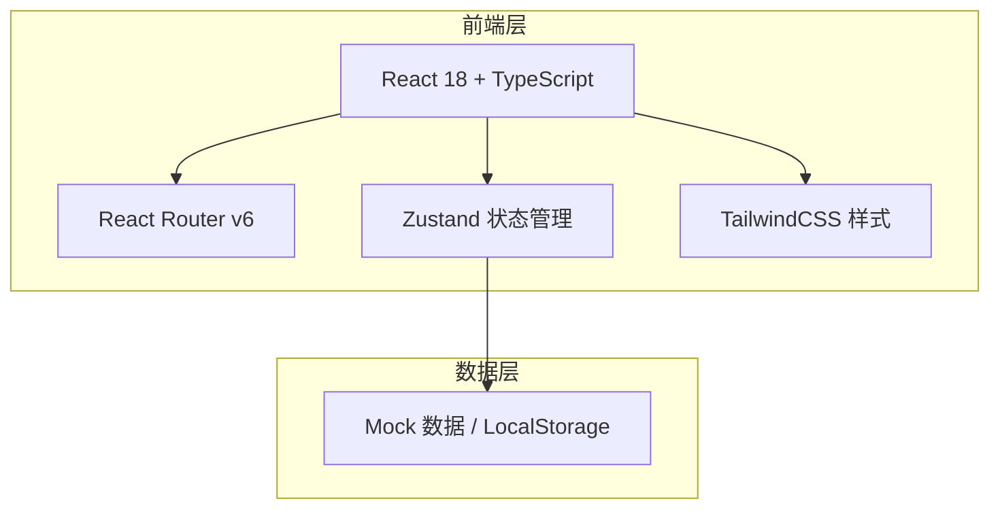
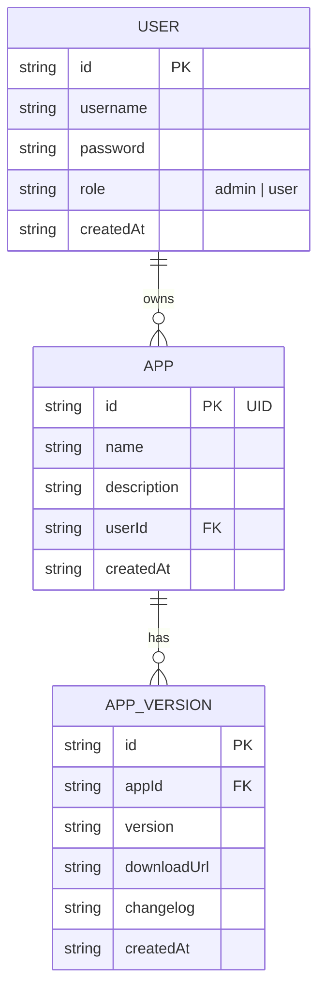

# HotUpdate API 快速平台 - 技术架构文档

## 1. 架构设计



## 2. 技术描述

- **前端**：React 18 + TypeScript + TailwindCSS 3 + Vite
- **初始化工具**：vite-init（react-ts 模板）
- **后端**：无（纯前端项目，使用 Mock 数据）
- **状态管理**：Zustand
- **路由**：React Router v6
- **图标**：阿里巴巴图标库（iconfont）- 通过 CSS 引入
- **数据存储**：LocalStorage 模拟持久化

## 3. 路由定义

| 路由 | 用途 |
|------|------|
| / | 首页（展示页面） |
| /login | 登录页面 |
| /dashboard | 用户后台（需登录） |
| /admin | 管理员后台（需管理员权限） |
| /dashboard/app/:id | App 配置页面 |

## 4. 数据模型

### 4.1 数据模型定义



### 4.2 TypeScript 类型定义

```typescript
interface User {
  id: string;
  username: string;
  password: string;
  role: 'admin' | 'user';
  createdAt: string;
}

interface App {
  id: string;        // UID
  name: string;
  description: string;
  userId: string;
  createdAt: string;
}

interface AppVersion {
  id: string;
  appId: string;
  version: string;
  downloadUrl: string;
  changelog: string;
  createdAt: string;
}
```

### 4.3 UID 生成规则

格式：`yy` + `随机4字母` + `mm` + `随机4字母` + `dd` + `随机4字母` + `hh` + `随机4字母` + `分钟` + `随机4字母`

示例：`25aBcD03eFgH15iJkL10mNoP30qRsT`

- yy: 年份后两位
- mm: 月份（01-12）
- dd: 日期（01-31）
- hh: 小时（00-23）
- 分钟: 分钟（00-59）
- 随机字母: 每组4个随机大小写字母

## 5. 项目结构

```
src/
├── components/
│   ├── Navbar.tsx              # 悬浮导航栏
│   ├── GlassCard.tsx           # 玻璃卡片组件
│   ├── AppCard.tsx             # App 展示卡片
│   ├── CreateAppModal.tsx      # 创建 App 弹窗
│   └── VersionConfig.tsx       # 版本配置表单
├── pages/
│   ├── Home.tsx                # 首页
│   ├── Login.tsx               # 登录页
│   ├── Dashboard.tsx           # 用户后台
│   ├── AdminDashboard.tsx      # 管理员后台
│   └── AppConfig.tsx           # App 配置页
├── stores/
│   ├── authStore.ts            # 认证状态
│   └── appStore.ts             # App 数据状态
├── utils/
│   ├── uidGenerator.ts         # UID 生成器
│   └── storage.ts              # LocalStorage 工具
├── types/
│   └── index.ts                # 类型定义
├── App.tsx
├── main.tsx
└── index.css                   # 全局样式（玻璃液态效果）
```
